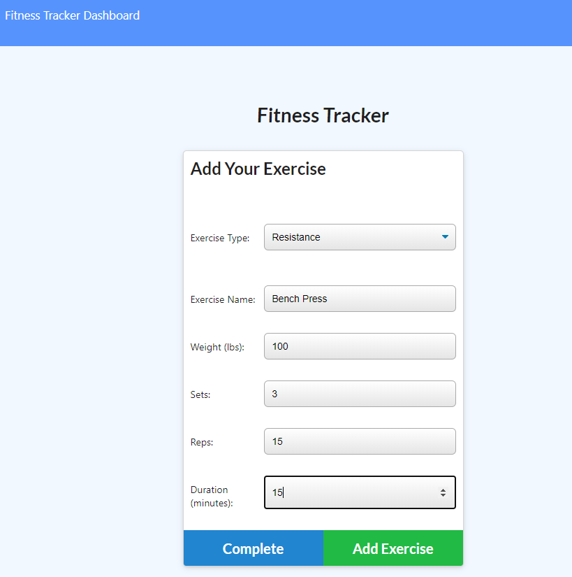
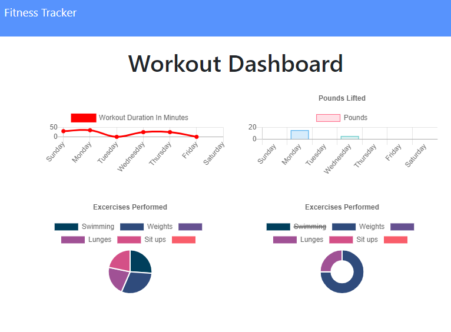

# Workout Tracker

Deployed of Heroku: https://enigmatic-tundra-66583.herokuapp.com/

## Table of Contents

- [Description](#description)
- [Functionality](##functionality)
- [Installation](##installation)
- [Utilized](##utilized)
- [Contributing](##contributing)

## Description

App to help you record your workout days with the description of exercises.

## Functionality

On the home page the user is presented with three options:

- "Continue Workout". Click the button to add more exercises to the existing workout.
- "New workout". Click the button to start a new workout and record a new set of exercises.

### Adding exercises

When you add exercises, choose the type of the exercise: Cardio or Resistance, and enter the details of the exercise (Weight, Sets, Reps, etc.)
Click "Add Exercise" to add it to the current workout.
Click "Complete" to finish the workout.

- "Fitness tracker dashboard". Click the link to check your progress so far. The page displays two graphs: Exercises performed by Duration and Pounds Lifted. You can return to the home page by clicking "Fitness Tracker" link.

## Installation

For installation run this command:

<pre><code>npm install</code></pre>

## Utilized:

- [Semantic UI](https://semantic-ui.com/)
- [Charts JS](https://www.chartjs.org/)
- [MongoDB](https://www.mongodb.com/)

## Contributing

- [Luba Pecheneva](https://github.com/lp5786766)
